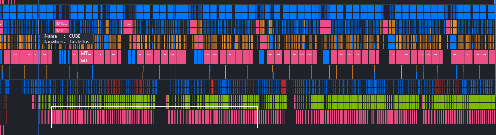
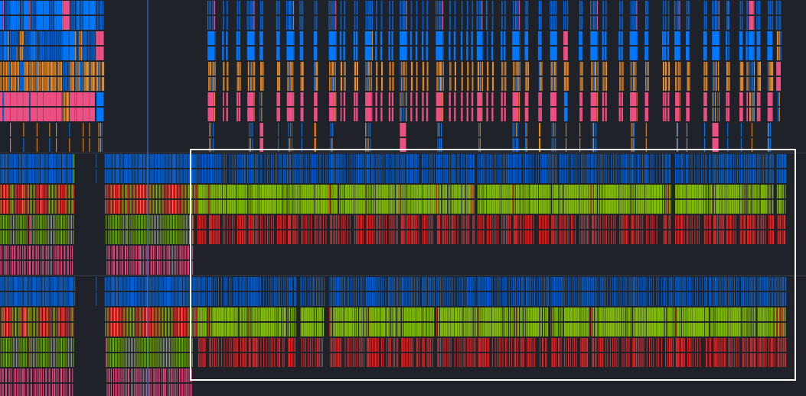
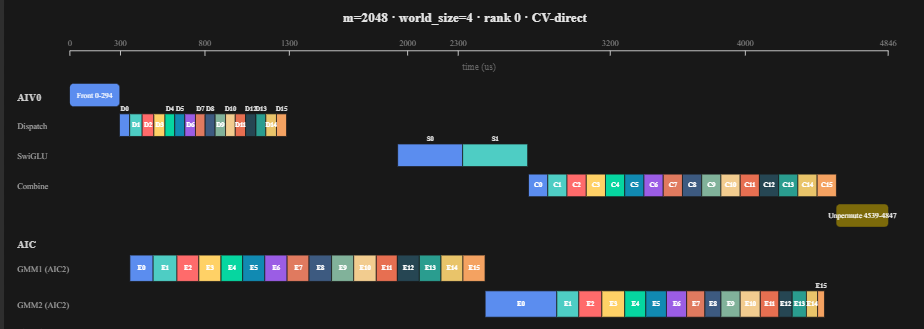

# pto-megamo A5
## 在A5做了哪些事情
- 根据A5的核数以及UB size，同步机制等做了下适配
- 使用A5的CV直通特性，对算子的GMM2->Combine阶段尝试做优化

## CV直通

### gmm2->combine的cv直通

当前跨 AIV 轮转：

```text
tile 0 -> AIV0
tile 1 -> AIV1
tile 2 -> AIV0
tile 3 -> AIV1
...
```

### 数据流

```text
时间向下，缩进表示并发分支

GMM2 AIC：生产 tile k，lane 0
    int8 A x int8 W2
          |
          v
    L0C int32 accumulator
          |
          | per-column scale2GM + cast half
          v
    pto::TASSIGN(Acc/Scaling/CV)
    pto::TMOV<SingleModeVec0>
    set ready 5
          |
          +-- AIV0：消费 tile k
          |     AIV0 UB full tile
          |          |
          |     pto::TPOP<TILE_NO_SPLIT>
          |     pto::TASSIGN
          |     pto::TLOAD(perTokenScale2：FP32 量化 scale，GM -> UB)
          |     pto::TCVT(CV half -> FP32) / pto::TMULS(perTokenScale2)
          |     pto::TSTORE
          |     pto::TFREE<TILE_NO_SPLIT>
          |          |
          |          +-- free 6
          |
          +-- 并发：GMM2 AIC 继续生产 tile k+1，lane 1
                int8 A x int8 W2
                      |
                      v
                L0C int32 accumulator
                      |
                      | per-column scale2GM + cast half
                      v
                pto::TASSIGN(Acc/Scaling/CV)
                pto::TMOV<SingleModeVec1>
                set ready 21
                      |
                      +-- AIV1：消费 tile k+1
                      |     AIV1 UB full tile
                      |          |
                      |     pto::TPOP<TILE_NO_SPLIT>
                      |     pto::TASSIGN
                      |     pto::TLOAD(perTokenScale2：FP32 量化 scale，GM -> UB)
                      |     pto::TCVT(CV half -> FP32) / pto::TMULS(perTokenScale2)
                      |     pto::TSTORE
                      |     pto::TFREE<TILE_NO_SPLIT>
                      |          |
                      |          +-- free 22
                      |
                      +-- 并发：GMM2 AIC 等待/复用 free 6，生产 tile k+2，lane 0
                            ...
```
### GMM2->Combine cv直通优化效果
--world-size 4 --m XX  --k 7168 --n 4096 --topk 8 --experts 16

| M | base kernel avg | cv_direct kernel avg | cv_direct - base | 变化 |
| ---: | ---: | ---: | ---: | ---: |
| 16 | 507.24 us | 502.86 us | -4.38 us | -0.86% |
| 32 | 524.86 us | 520.87 us | -3.99 us | -0.76% |
| 64 | 563.18 us | 558.66 us | -4.52 us | -0.80% |
| 128 | 673.29 us | 645.96 us | -27.33 us | -4.06% |
| 512 | 1443.41 us | 1416.70 us | -26.71 us | -1.85% |
| 1024 | 2521.22 us | 2515.63 us | -5.59 us | -0.22% |
| 2048 | 4840.56 us | 4836.67 us | -3.89 us | -0.08% |

以下是非直通模式抓的prof数据，从prof看MTE2是有一定的时间消耗的，GMM2->Combine直通应该是有收益的，但是实测收益有限



## GMM2->Combine cv直通后A5 核采样的流水overlap情况


可以看到两个aiv都在忙，并且没有大空泡，但是实测的端到端收益不大

## GMM2->Combine cv直通后A5整体的流水overlap情况

